<!--
  ─────────────────────────────────────────────────────────────
  rubenmtzb · profile README
  Design tokens (mirrors rubenitx.me)
    bg #030712 · surface #0B1120 · border #1E293B
    primary #0A84FF · accent #00E5FF / #00D9FF · muted #94A3B8
  Custom assets: assets/header.svg · assets/divider.svg · assets/footer.svg
  Project covers: assets/cover-{transcriber,financecore,sars,portfolio}.svg
  ─────────────────────────────────────────────────────────────
-->

<p align="center">
  
</p>

<p align="center">
  <a href="https://rubenitx.me"></a>
  <a href="https://www.linkedin.com/in/rubenmartinezbernabe/"></a>
  <a href="mailto:rmartbernabe@gmail.com"></a>
  <a href="https://orcid.org/0009-0005-5467-8436"></a>
</p>


## `00` &nbsp;//&nbsp; Identity

Full-Stack Developer with solid experience in the **Java ecosystem**. I turn complex problems into efficient, scalable and robust solutions for large-scale projects — backend services with **Spring Boot**, interactive frontends with **React**, and a track record in REST API design, batch processing and Liferay portal development.

Clean domain boundaries, pragmatic decisions and systems that age well.

```json
{
  "role": "Software Engineer",
  "company": "Egarsat",
  "location": "Barcelona, Spain",
  "focus": "APIs, service integrations and web tools for everyday workflows",
  "mindset": "Systems thinking, constant iteration, obsession with detail",
  "currently": ["LLM-assisted workflows", "DevOps", "smart contracts"]
}
```


## `01` &nbsp;//&nbsp; Stack

<table>
  <tr>
    <td valign="top" width="110"><b>Backend</b></td>
    <td>
      
      
      
      
      
      
      
    </td>
  </tr>
  <tr>
    <td valign="top"><b>Frontend</b></td>
    <td>
      
      
      
      
      
      
      
    </td>
  </tr>
  <tr>
    <td valign="top"><b>Data</b></td>
    <td>
      
      
      
    </td>
  </tr>
  <tr>
    <td valign="top"><b>Ops</b></td>
    <td>
      
      
      
      
      
      
      
      
    </td>
  </tr>
</table>


## `02` &nbsp;//&nbsp; Selected work

<table>
  <tr>
    <td width="50%" valign="top">
      <a href="https://yt.rubenitx.me/"></a>
      <p></p>
      <h3>YouTubeTranscriber</h3>
      <p>Turns a public YouTube video into timestamped text you can read, translate and reuse. Captions pipeline with <code>yt-dlp</code>, <code>whisper.cpp</code> fallback for videos without subtitles, and DeepL for dual-language output. No account required.</p>
      <p>
        
        
        
        
      </p>
      <p><a href="https://yt.rubenitx.me/"><b>Open app&nbsp;↗</b></a> · <a href="https://rubenitx.me/work/youtube-transcriber/">Read the case</a></p>
    </td>
    <td width="50%" valign="top">
      <a href="https://rubenitx.me/work/finance-core/"></a>
      <p></p>
      <h3>FinanceCore</h3>
      <p>One workspace for accounts, spending, savings goals and crypto holdings. Decoupled architecture — financial engine and client layer evolve independently — with clean domain boundaries, observability and long-term maintainability as first-class concerns.</p>
      <p>
        
        
        
        
      </p>
      <p><a href="https://rubenitx.me/work/finance-core/"><b>Read the case&nbsp;↗</b></a> · <i>private code, synthetic-data walkthrough</i></p>
    </td>
  </tr>
  <tr>
    <td width="50%" valign="top">
      <a href="http://sarscov2-mutation-portal.urv.cat"></a>
      <p></p>
      <h3>The Mutational Landscape of SARS-CoV-2</h3>
      <p>Interactive portal for exploring mutations across the SARS-CoV-2 genome, built end to end with <b>Universitat Rovira i Virgili</b> — from design to production. Interdisciplinary work at the intersection of software engineering and bioinformatics, with results published in <i>IJMS</i>.</p>
      <p>
        
        
        
        
      </p>
      <p><a href="http://sarscov2-mutation-portal.urv.cat"><b>Open portal&nbsp;↗</b></a> · <a href="https://www.mdpi.com/1422-0067/24/10/9072">Publication</a></p>
    </td>
    <td width="50%" valign="top">
      <a href="https://rubenitx.me"></a>
      <p></p>
      <h3>rubenitx.me</h3>
      <p>Personal site and CV: static output, bilingual EN/ES, printer-ready résumé route and interactive case studies. And a Killua <i>Godspeed</i> mini-game hidden behind the header — three levels, section orbs and an electric aura. Because a portfolio should also be fun to break.</p>
      <p>
        
        
        
      </p>
      <p><a href="https://rubenitx.me"><b>Visit&nbsp;↗</b></a> · <a href="https://rubenitx.me/cv/">CV</a></p>
    </td>
  </tr>
</table>

## `03` &nbsp;//&nbsp; Telemetry

<p align="center">
  
</p>

<p align="center">
  
</p>

<p align="center">
  <picture>
    <source media="(prefers-color-scheme: dark)" srcset="https://raw.githubusercontent.com/rubenmtzb/rubenmtzb/output/snake.svg" />
    <source media="(prefers-color-scheme: light)" srcset="https://raw.githubusercontent.com/rubenmtzb/rubenmtzb/output/snake-light.svg" />
    
  </picture>
</p>


## `04` &nbsp;//&nbsp; Working principles

<table>
  <tr>
    <td width="240" align="center">
      
      <br />
      <sub><code>nen type: transmutation</code></sub>
      <br />
      <sub><i>turns caffeine into commits</i></sub>
    </td>
    <td valign="middle">
      
    </td>
  </tr>
</table>


## `05` &nbsp;//&nbsp; Outside the code

<details>
  <summary><b>&nbsp;Climbing, travel &amp; mechanical keyboards</b> &nbsp;<code>expand</code></summary>
  <br />

  <p>Climbing walls and via ferratas, long walks in cities I don't know yet — Rome, London, Granada, Mallorca — and sunsets somewhere between places. The things that happen away from the screen are the ones that shape how I think about the ones on it.</p>

  <p>Mechanical keyboards are the hands-on version of the same obsession: every build balances layout, materials, switches, sound and feel. Not a desk accessory — a tool tuned around how I work.</p>

  <table>
    <tr>
      <td><code>build 01</code></td>
      <td><b>Neo65</b></td>
      <td><sub>65% · gasket mount · wired hotswap</sub></td>
      <td></td>
    </tr>
    <tr>
      <td><code>build 02</code></td>
      <td><b>HHKB Professional Hybrid Type-S</b></td>
      <td><sub>60% · Topre 45g · Snow + Wasabi · hand-lubed</sub></td>
      <td></td>
    </tr>
    <tr>
      <td><code>build 03</code></td>
      <td><b>EVO75</b></td>
      <td><sub>75% · butterfly leaf spring · tri-mode</sub></td>
      <td></td>
    </tr>
    <tr>
      <td><code>build 04</code></td>
      <td><b>Corne V4</b></td>
      <td><sub>42-key split · RP2040 · low-profile</sub></td>
      <td></td>
    </tr>
  </table>

  <p><sub>There's a typing speed trial and a layer-by-layer build archive on <a href="https://rubenitx.me/#archive">rubenitx.me</a> if you want to hear them.</sub></p>
</details>

<h3 align="center">Coding soundtrack</h3>

<p align="center">
  <a href="https://music.apple.com/es/playlist/code-in-flow/pl.u-XkD0vNBTD4LVDko">
    
  </a>
</p>

<p align="center">
  <b>Code in Flow</b><br />
  <sub><i>Downtempo, electronic textures and ambient beats for long sessions.</i></sub>
</p>


## `06` &nbsp;//&nbsp; Contact

<p align="center">
  <b>A manual workflow, or systems that don't talk to each other?</b><br />
  <sub>Tell me what your team does today and where it gets stuck. I can help define and build the API,<br />integration or web interface you need — starting from scope and constraints, not from promises.</sub>
</p>

<p align="center">
  <a href="mailto:rmartbernabe@gmail.com"></a>
  <a href="https://www.linkedin.com/in/rubenmartinezbernabe/"></a>
  <a href="https://rubenitx.me/cv/"></a>
  <a href="https://orcid.org/0009-0005-5467-8436"></a>
</p>

<p align="center">
  
</p>

<p align="center">
  
</p>
