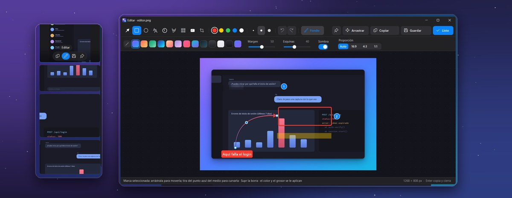
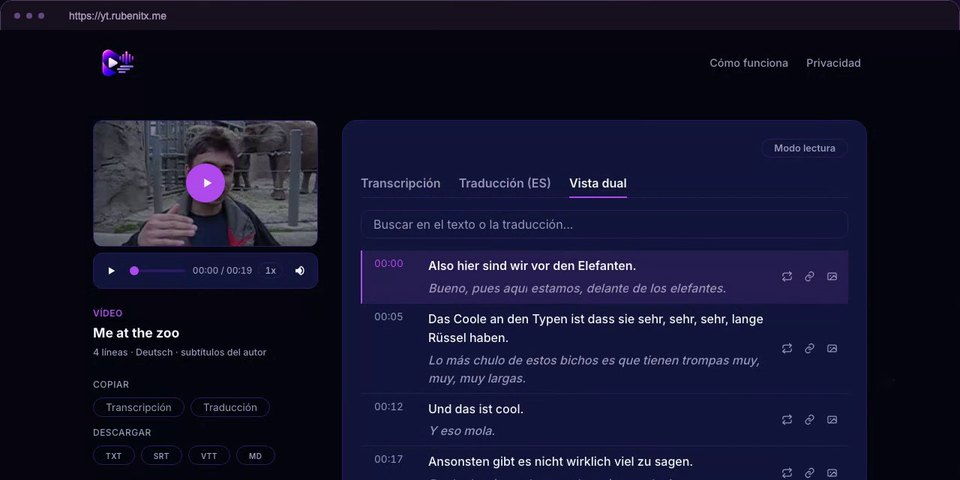
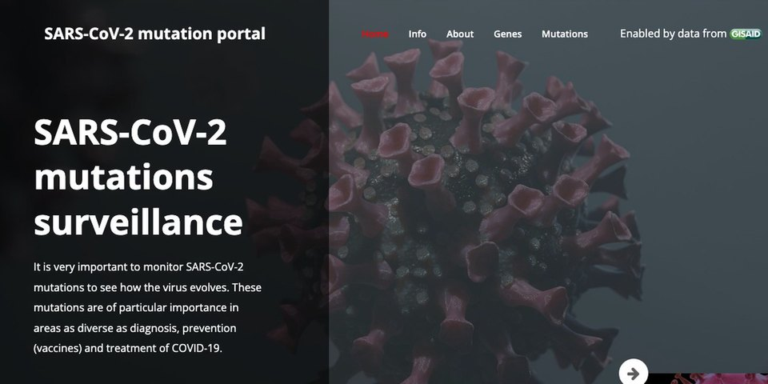
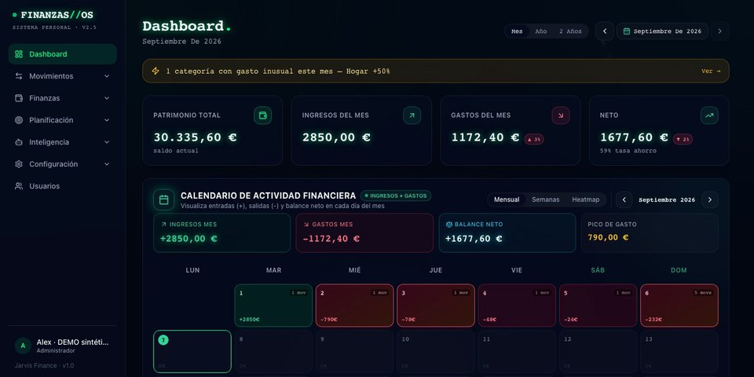
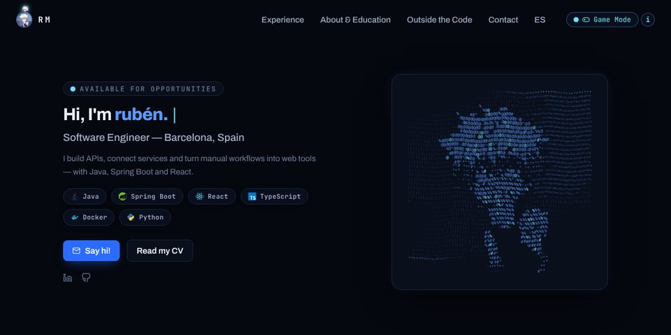
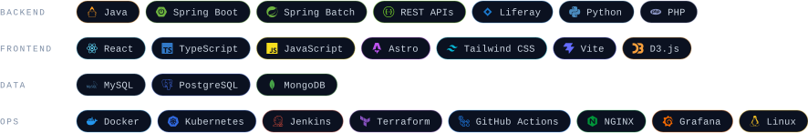

<!--
  rubenitx · profile README
  Tokens (shared with rubenitx.me)
    bg #030712 · surface #0B1120 · border #1E293B
    primary #0A84FF · accent #00D9FF · muted #94A3B8
  All images are local SVGs generated by the scripts in tools/:
    node tools/build-orbits.mjs   header (inner solar system on 8 Oct 2026)
    node tools/build-badges.mjs   stack sheet, tech strips, link buttons
-->

  

  
  
  
  
  

I'm **Rubén Martínez Bernabe**, a full-stack developer based in Barcelona. At [Egarsat](https://github.com/Egarsat) I work on **Java** and **Spring Boot** services, **React** front ends, Spring Batch jobs and Liferay portals. I'm also studying Software Engineering at UOC.

Outside work I build small products end to end, from the API to the release: a screenshot tool for Windows, a YouTube transcriber and a research portal with Universitat Rovira i Virgili. Lately most of my spare time goes into LLM-assisted development, DevOps and smart contracts.

## Selected work

<table>
  <tr>
    <td colspan="2" valign="top">
      
      <h3>Stackshot</h3>
      
A screenshot tool for Windows. Press <kbd>Print Screen</kbd>, select an area, and the capture stays in a floating stack, ready to drag into a chat, paste or annotate. It also handles scrolling capture, MP4 and GIF recording and pinning to the screen, all from a single 0.7 MB executable that installs without admin rights.

      
C# · WinForms · .NET Framework

      
<a href="https://github.com/rubenitx/stackshot/releases/latest"><b>Download</b></a> · <a href="https://github.com/rubenitx/stackshot">Source</a> · <a href="https://github.com/rubenitx/stackshot/blob/main/CHANGELOG.md">Changelog</a>

    </td>
  </tr>
  <tr>
    <td width="50%" valign="top">
      
      <h3>YouTubeTranscriber</h3>
      
Paste a public YouTube link and get timestamped text you can read, translate and reuse. It reads the video's captions with <code>yt-dlp</code>, falls back to <code>whisper.cpp</code> when there are none, and uses DeepL for side-by-side translation. No account needed.

      
Java 21 · Spring Boot · Astro · React

      
<a href="https://yt.rubenitx.me/"><b>Open app</b></a> · <a href="https://rubenitx.me/work/youtube-transcriber/">Case study</a>

    </td>
    <td width="50%" valign="top">
      
      <h3>SARS-CoV-2 mutation portal</h3>
      
An interactive portal for exploring mutations across the SARS-CoV-2 genome, built with a research team at <b>Universitat Rovira i Virgili</b>. I owned the software side, from design to production. The study was published in the <i>International Journal of Molecular Sciences</i> (2023).

      
TypeScript · PHP · Python · D3.js

      
<a href="http://sarscov2-mutation-portal.urv.cat"><b>Open portal</b></a> · <a href="https://www.mdpi.com/1422-0067/24/10/9072">Paper</a>

    </td>
  </tr>
  <tr>
    <td width="50%" valign="top">
      
      <h3>FinanceCore</h3>
      
A personal finance workspace for accounts, spending, savings goals and crypto holdings. The financial engine and the client are separate services, so each can change without breaking the other. The code is private; the screenshot and the case study use synthetic data.

      
React · TypeScript · FastAPI · PostgreSQL

      
<a href="https://rubenitx.me/work/finance-core/"><b>Case study</b></a>

    </td>
    <td width="50%" valign="top">
      
      <h3>rubenitx.me</h3>
      
My personal site and CV. Static, in English and Spanish, with a print-ready CV and written case studies. There's also a small <i>Godspeed</i> mini-game hidden behind the header, if you look for it.

      
Astro · Tailwind CSS · TypeScript

      
<a href="https://rubenitx.me"><b>Visit</b></a> · <a href="https://github.com/rubenitx/rubenitx.github.io">Source</a>

    </td>
  </tr>
</table>

## Stack

  

## How I work

- I settle the domain model and the API contract before picking frameworks.
- I ship early with logs and metrics in place, then improve from what production shows.
- I use AI coding tools for the repetitive parts and review every change myself.
- Docs go in the same pull request as the code.

## Outside the code

  
<b>Climbing, travel and mechanical keyboards</b>

   

  
I climb indoor walls and via ferratas, and I travel whenever I can. Recent trips: Rome, London, Granada and Mallorca.

  
I also build mechanical keyboards. Each one is a set of trade-offs between layout, materials, switches and sound.

  <table>
    <tr>
      <td><b>HHKB Professional Hybrid Type-S</b></td>
      <td>60% · Topre 45g · Snow + Wasabi · hand-lubed</td>
      <td></td>
    </tr>
    <tr>
      <td><b>Neo65</b></td>
      <td>65% · gasket mount · wired hotswap</td>
      <td></td>
    </tr>
    <tr>
      <td><b>EVO75</b></td>
      <td>75% · butterfly leaf spring · tri-mode</td>
      <td></td>
    </tr>
    <tr>
      <td><b>Corne V4</b></td>
      <td>42-key split · RP2040 · low-profile</td>
      <td></td>
    </tr>
  </table>

  
While coding I usually have <a href="https://music.apple.com/es/playlist/code-in-flow/pl.u-XkD0vNBTD4LVDko">Code in Flow</a> on, a downtempo and ambient playlist I keep on Apple Music.

## Contact

The fastest way to reach me is email: [rmartbernabe@gmail.com](mailto:rmartbernabe@gmail.com). I'm also on [LinkedIn](https://www.linkedin.com/in/rubenmartinezbernabe/), and my publications are listed on [ORCID](https://orcid.org/0009-0005-5467-8436).
